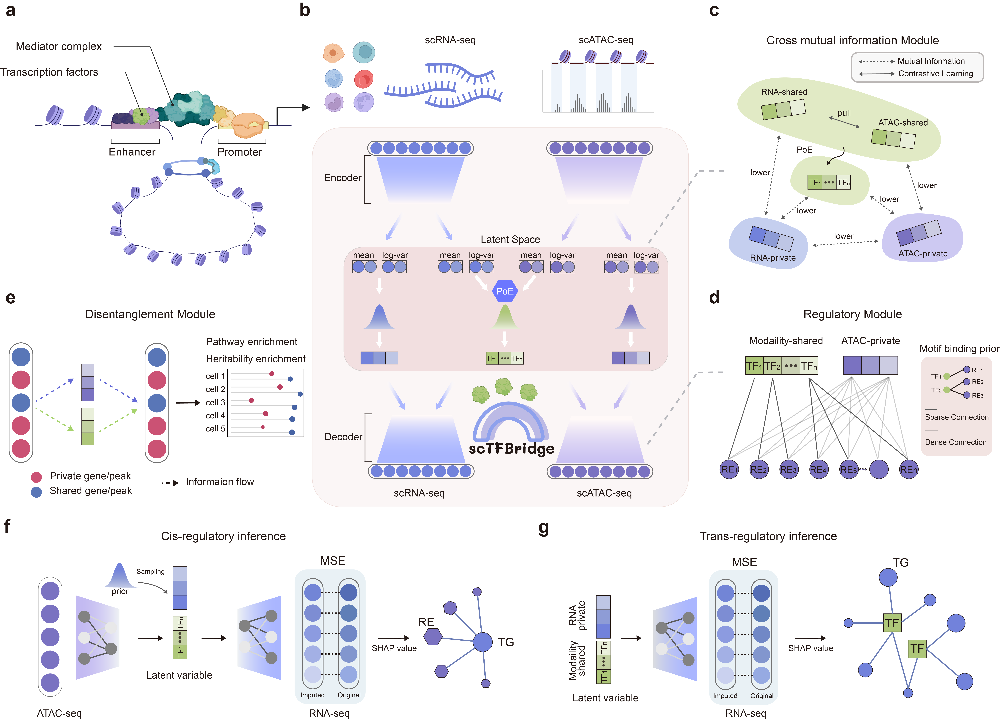

# scTFBridge
[](https://pypi.org/project/sctfbridge/)

**scTFBridge** is a novel single-cell multi-omics integration method designed for modality disentanglement and gene regulatory network (GRN) inference. It leverages transcription factor (TF)-motif binding information to model complex regulatory relationships in single-cell data, enabling researchers to uncover insights into gene regulation across multiple omics layers.

This method models the complex regulatory relationships in single-cell data, allowing researchers to uncover deep insights into gene regulation across multiple omics layers, such as scRNA-seq and scATAC-seq.



### Key Features:
-   🧬 **True Multi-Omic Integration**: Seamlessly integrates scRNA-seq and scATAC-seq data.
-   🧩 **Modality Disentanglement**: Learns modality-private and shared representations for each omics data.
-   🕸️ **GRN Inference**: Infers both *cis* (RE-to-gene) and *trans* (TF-to-gene) regulatory interactions.
-   🧠 **Biologically Informed**: Uses TF-motif binding data to guide the model and improve accuracy.
-   🔮 **Cross-Modal Prediction**: Predicts the state of one modality from another (e.g., generate RNA expression from ATAC profiles).

---

## Contents
- [Installation](#installation)
- [Quick Start](#quick-start)
- [Tutorials](#tutorials)
- [Citation](#-citation)
---

## 🚀 Installation


### Prerequisites

- Python 3.12 or higher
- CUDA (optional, for GPU acceleration)
- Required libraries are listed in requirements.txt. We recommend employing conda to create the environment to run scTFBridge. 


### Install from source
To install scTFBridge from source, we recommend following steps:
```bash
# Clone the repository
git clone https://github.com/FengAoWang/scTFBridge.git

# install with pip
pip install sctfbridge
```


## ⚡ Quick Start
We provide the code in test_pypi_sctfbridge.ipynb to quickly employ scTFBridge. Here, we provide a demo to preprocess and train scTFBridge using a single-cell multi-omics dataset. The rheumatoid arthritis multi-omics dataset used in this demo is publicly available on the GEO database under accession code GSE243917.
### Data filtering
This step generates the filtered data of scRNA-seq and scATAC-seq in defined output_path.
```bash
from src.sctfbridge.utils.data_processing import multiomics_processing, preload_TF_binding
import anndata


dataset = 'PBMC'
output_path = f'filter_data/{dataset}/'

rna_adata = anndata.read_h5ad(f'/path/to/your/data/10x-Multiome-Pbmc10k-RNA.h5ad')
atac_data = anndata.read_h5ad(f'/path/to/your/data/10x-Multiome-Pbmc10k-RNA.h5ad')


TF_name = '/data2/wfa/project/single_cell_multimodal/data/GRN/data_bulk/TFName.txt'
TF_name = open(TF_name, 'r').readlines()
for i in range(len(TF_name)):
    TF_name[i] = TF_name[i].replace('\n', '')


multiomics_processing([rna_adata, atac_data],
                            output_path,
                            TF_name,
                            3000,
                            0.01, )

rna_adata = anndata.read_h5ad(f'filter_data/{dataset}/RNA_filter.h5ad')
```

### Prepare TF-Motif Binding file
This step generates the mask matrix of TF to RE, stored in defined tf_binding_output_path 
```bash
GRNdir = '/data2/wfa/project/single_cell_multimodal/data/GRN/data_bulk/'
tf_binding_output_path = f'filter_data/{dataset}/TF_binding/'
preload_TF_binding(output_path, GRNdir, tf_binding_output_path)
```

### loading filtered RNA and ATAC data
```bash
dataset_name = 'human_PBMC'
cell_key = 'cell_type'
batch_key = ''

gex_data = anndata.read_h5ad(f'filter_data/{dataset_name}/RNA_filter.h5ad')
atac_adata = anndata.read_h5ad(f'filter_data/{dataset_name}/ATAC_filter.h5ad')
TF_adata = anndata.read_h5ad(f'filter_data/{dataset_name}/TF_filter.h5ad')
mask_path = f'filter_data/{dataset_name}/TF_binding/TF_binding.txt'
```

### Init and train scTFBridge model
```bash
model = scTFBridge.from_anndata(
    gex_data,
    atac_adata,
    TF_adata,
    mask_path,
    batch_key='',
    device=torch.device('cuda:7'),
)
model.fit(
    [gex_data, atac_adata, TF_adata],
)
model.save('sctfbridge_model', overwrite=True)

```
### Downstream Analysis with the Trained Model

#### A.Get disentangled latent representations
Extract the learned embeddings for visualization (UMAP), clustering, or other analyses.
```bash
output = model.get_embeddings(
    [gex_data, atac_adata, TF_adata],
)
```

#### B.Cross omics prediction of scTFBridge
Predict one modality from another. For example, generate gene expression profiles from chromatin accessibility data.
```bash
RNA_generated = model.predict_cross_omics(
    atac_adata,
    'RNA',
    device=torch.device('cuda:7'),
)
```


#### C.Inference cis-regulation(RE to target gene) from trained scTFBridge model
```bash
from sctfbridge.model import explain_RE2TG
output = explain_RE2TG(model,
                       [gex_data, atac_adata, TF_adata],
                       'human_PBMC',
                       use_gene_list=gex_data.var.index[:10],
                       cell_type='CD14 Mono',
                       cell_key='cell_type',
                       batch_key='',
                       device=torch.device('cuda:7'),
                       tf_binding_path=f'filter_data/{dataset_name}/TF_binding/')

```

#### D.Inference trans-regulation(TF to target gene) from trained scTFBridge model
```bash
from sctfbridge.model import explain_TF2TG
TF_output = explain_TF2TG(model,
                          [gex_data, atac_adata, TF_adata],
                          cell_type='CD14 Mono',
                          cell_key='cell_type',
                          batch_key='',
                          device=torch.device('cuda:7')
                          )

```

## 📚 Tutorials
Tutorials with more detailed examples and advanced use cases will be available soon in the `tutorials/` directory. For a working example, please refer to the `test_pypi_sctfbridge.ipynb` notebook included in this repository.

## 📄 Citation
If you use scTFBridge in your research, please cite our publication:

> **scTFBridge: A Disentangled Deep Generative Model Informed by TF-Motif Binding for Gene Regulation Inference in Single-Cell Multi-Omics**
>
> Feng, A. Wang, *et al*. (2025). *bioRxiv*.
>
> doi: [`10.1101/2025.01.16.633293v1`](https://www.biorxiv.org/content/10.1101/2025.01.16.633293v1)


